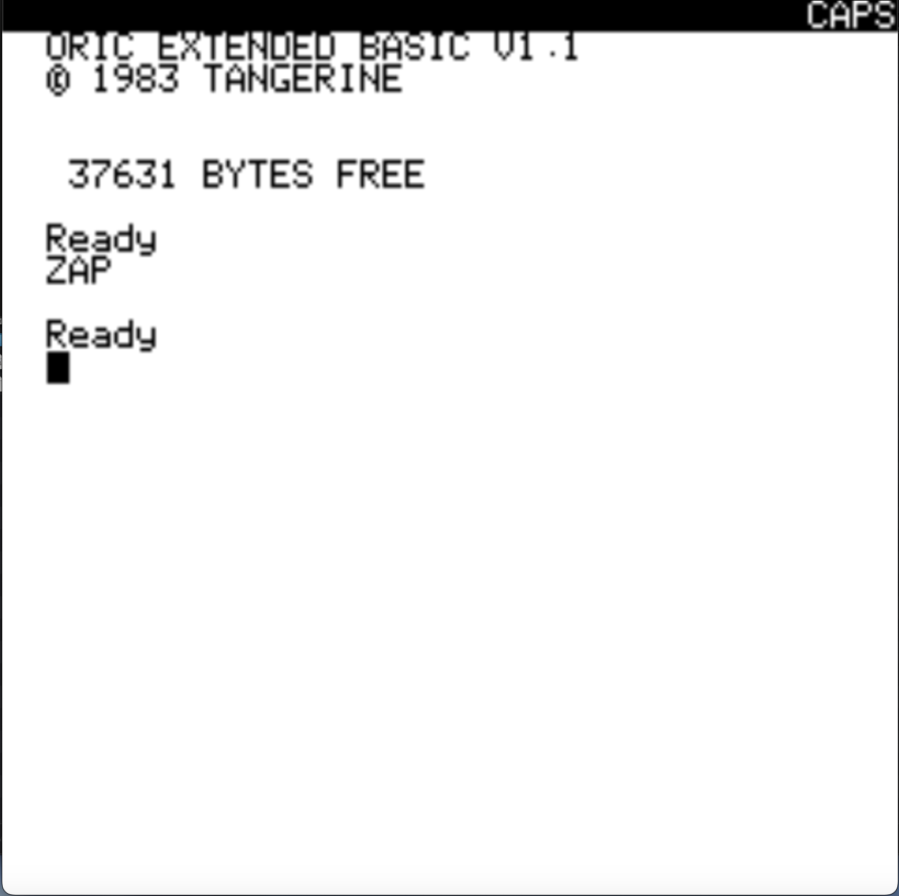
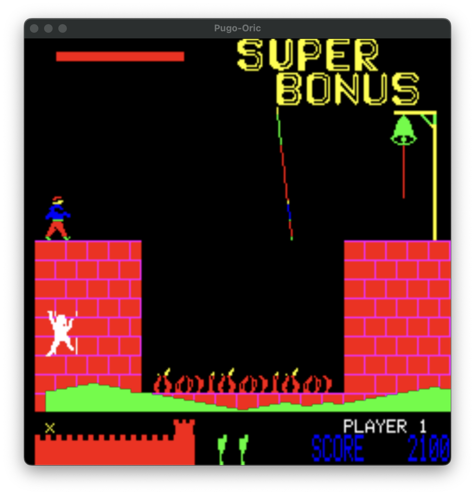
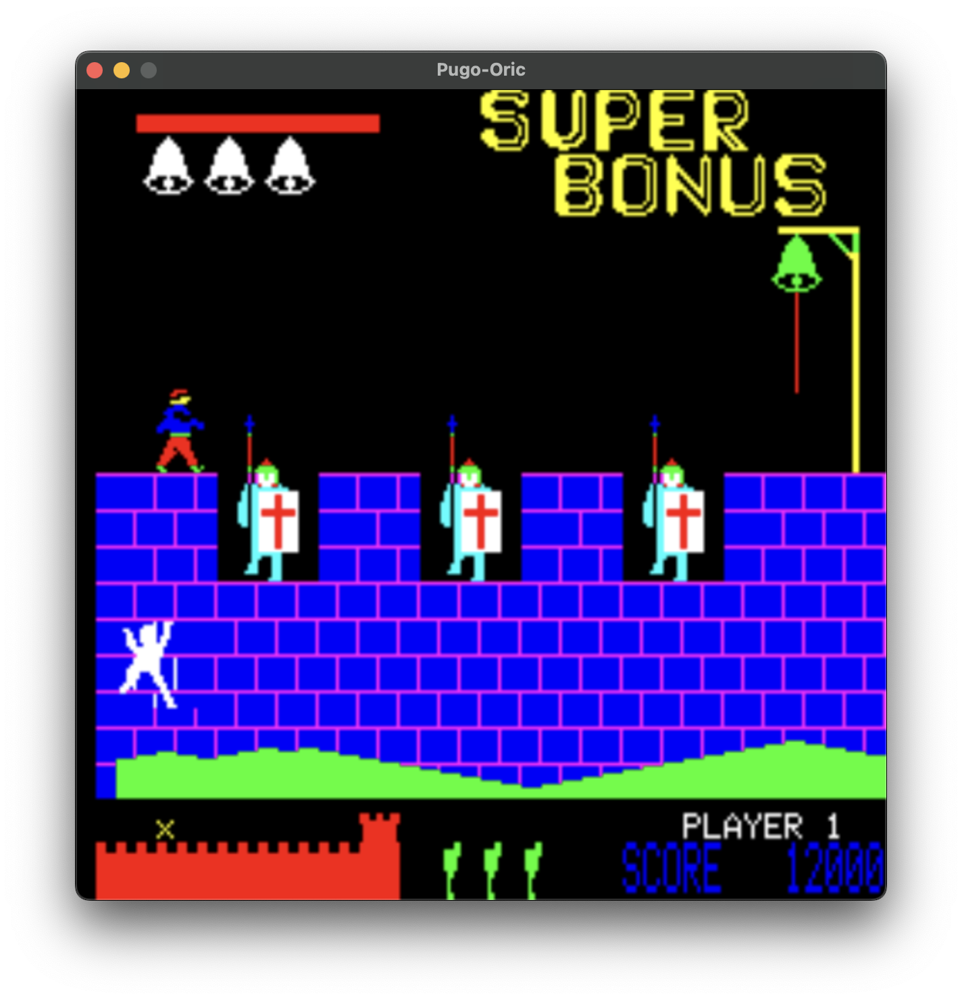

# Pugo Oric


This project implements a basic Oric computer emulator with graphics, sound, etc.
All code is written from scratch.

It is my absolutely slowest project, just made out of love to programming and to my first computer.





## Background

This is the result of a *very* long and low intensive hobby project I have worked on
since 2009, which currently is 14 years.

The purpose was to develop an emulator of the first computer I ever got,
as a Christmas gift some 40 years ago. The computer was an Oric 1, and it
was fantastic back then!

There already is a brilliant emulator of Oric: Oricutron, which is more
complete than this project ever likely will be. The purpose of my emulator
project has been to learn more about how emulators work and to close the circle
by learning more about the computer I got as a kid.


## Building

The project should be possible to compile on Linux and macOS using CMake.

### Dependencies

The following dependencies are required.

 * `boost`
 * `sdl2`
 * `sdl2_image`

### Compile with CMake

This should typically be done like the following.

```
$ mkdir build
$ cd build
$ cmake ..
$ make -j10
```

## Running

The program currently looks for ROM files from the `ROMS` directory in the project
root, so you might want to run the program from there:

```
$ ./build/oric
```

### Command line arguments

Run the emulator with flag `-?` (or `--help`) to see available parameters.

```
$ ./build/oric -?

Usage: oric [options]
Allowed options:
  --help                produce help message
  -m [ --monitor ]      start in monitor mode
  -a [ --atmos ]        use Atmos ROM
  -t [ --tape ] arg     Tape file to use
```

### Control keys

The following control keys can alter the emulator behavior.

* `F4`: Make snapshot (to RAM)
* `F5`: Load snapshot (from RAM)
* `F10`: Soft reset the emulator (NMI)
* `F12`: Toggle warp mode (go as fast as possible).


### Loading from tape image

To specify which tape TAP file to use, use the `--tape` or `-t` command line
argument:

```
$ ./build/oric --tape taps/hunchbk.tap
```

To load a tape program from the emulator you can try the following.

```
CLOAD"
```

To speed up the loading time it is possible to toggle warp mode with
`F12`.

## Exiting

Since the emulator does not have any GUI with interaction at this point
the best way is to simply close the window.

It is also possible to press `ctrl-c` in the terminal window where the
emulator was started. On the first press of `ctrl-c` the emulator will
enter the monitor mode. See the monitor section below for more 
information about the monitor. To exit for real, press `ctrl-c` a second 
time.

## Monitor

You can at any time enter a small monitor mode by pressing `ctrl-c`.

The monitor has commands like the following.

```
Available monitor commands:

h              : help (showing this text)
g <address>    : go to address and run
pc <address>   : set program counter to address
s [n]          : step one or possible n steps
i              : print machine info
v              : print VIA (6522) info
d              : disassemble from PC
d <address> <n>: disassemble from address and n bytes ahead
m <address> <n>: dump memory from address and n bytes ahead
quiet          : prevent debug output at run time
debug          : show debug output at run time
sr, softreset  : soft reset oric
```
 

## Timeline

As I work as a developer this has been a project I have gone back to for shorter
stints when normal work for some reason have had less amount of coding. That means
that this project has been extremely slow. But that has always been a wonderful thing!
I have never felt any pressure to work on it and instead hacked on it by pure love.

The first thing I developed was naturally the MOS 6502 emulation. That took several
years of now-and-then coding. Then after some delay the MOS 6522 VIA (IO) chip work
started and took some more years. After that I added graphics support, keyboard
emulation, tape loading and lastly sound.

The timeline is something like:

* 2009: MOS 6502 CPU
* 2014: MOS 6522 VIA
* 2016: Graphics
* 2017: Key input
* 2020: Tape loading
* 2023: AY3-8912 sound
* 2024: Cycle bug fixing, new monitor, blink mode, snapshots


## Contribution

Since this is a pet project I work on only when I like to and because I feel that
I should implement all by myself I am reluctant to accept any contributions. But 
the licence is GPL v3, so feel free to fork it and do what you like as long as
you follow that license.

## License

All code is licensed with GPL v3.

---
Sweden, Linghem 2024, Anders Piniesjö
