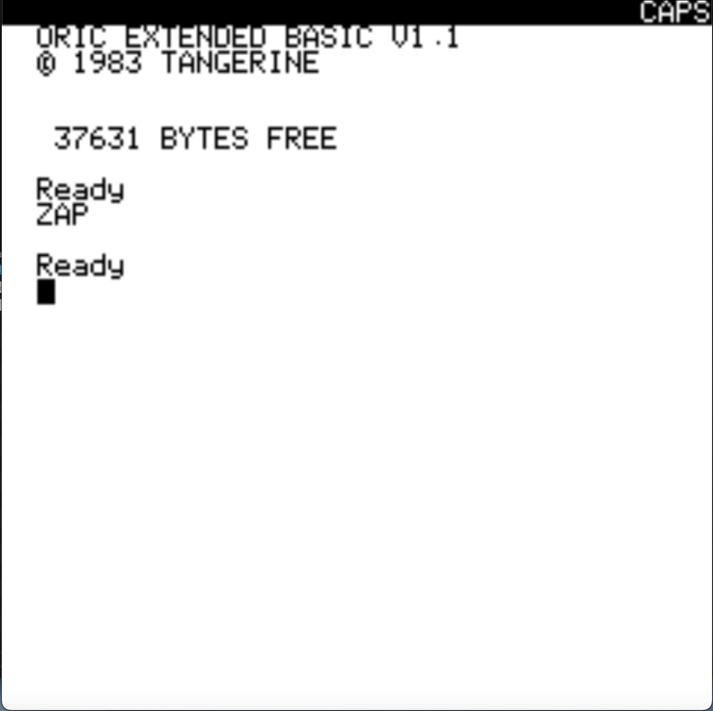
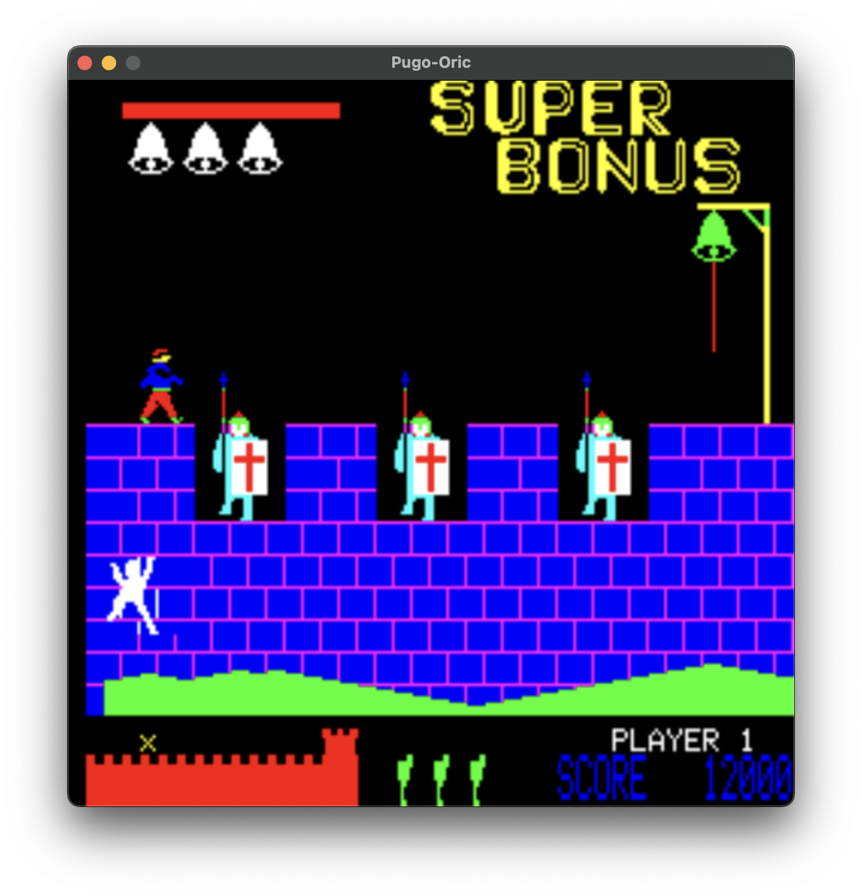

<p align="center">

</p>

*(Renamed from Pugo-Oric 2026)*


This project implements an Oric computer emulator with graphics, sound, tape and disk support.
All code is written from scratch.

It is my absolutely slowest project, just made out of love to programming and to my first computer.

<div>



</div>

## Background

This is the result of a *very* long and low intensive hobby project I have worked on
since 2009, which currently is 17 years.

The purpose was to develop an emulator of the first computer I ever got,
as a Christmas gift some 40 years ago. The computer was an Oric 1, and it
was fantastic back then!

There already is a brilliant emulator of Oric: Oricutron. The purpose of my emulator
is not to compete, but to learn more about how emulators work and to close the circle
by learning more about the computer I got as a kid.

<p align="center">

</p>

## Building

Auric has been developed and tested on Linux and MacOS. It should be possible to build it on Windows as well, 
but I have not tried that.

All building instructions are located in the `doc` directory.

 * To build with vcpkg, see [doc/BUILD_VCPKG.md](doc/BUILD_VCPKG.md).
 * To build with host libraries, see [doc/BUILD_HOST.md](doc/BUILD_HOST.md).

### CMake presets

This repository includes CMake presets for common build setups.

Example for Windows (Visual Studio 2022 + vcpkg):

```
set VCPKG_ROOT=C:\path\to\vcpkg
cmake --preset windows-vs2022
cmake --build --preset windows-vs2022-release -j 8
```

For detailed Windows notes, see [Windows.md](Windows.md).

## Running

This section describes how to run the emulator.

### ROM files

The program currently looks for ROM files from the `ROMS` directory in the project
root. It expects the following ROM files to exist.

| ROM file name  | Description                        |
|----------------|------------------------------------|
| `basic10.rom`  | Oric 1 ROM (for Oric 1 mode)       |
| `basic11b.rom` | Oric Atmos ROM (for Atmos mode)    |
| `microdis.rom` | For Microdisc disc drive emulation |

_I plan to add a configuration file options to specify ROM locations and ROM file names._

### Starting the emulator

```
$ ./build/auric
```

### Command line arguments

Run the emulator with flag `-?` (or `--help`) to see available parameters.

```
$ ./build/auric -?

Usage: auric [options]
Allowed options:
  -? [ --help ]         produce help message
  -1 [ --oric1 ]        use Oric 1 mode (default: Atmos mode)
  -w [ --width ] arg    window width in pixels
  -h [ --height ] arg   window height in pixels
  -t [ --tape ] arg     tape image file to use
  --tape-normal         disable tape turbo mode
  -d [ --disk1 ] arg    disk image file to use for drive 1
  --disk2 arg           disk image file to use for drive 2
  --disk3 arg           disk image file to use for drive 3
  --disk4 arg           disk image file to use for drive 4
  -m [ --monitor ]      start with GUI debugger open
  -v [ --verbose ]      verbose output

```

### Main menu

The in-emulator main menu can be toggled with `F1`. It allows you to change
the emulator settings, load tape and disk images, and more.

### Control keys

The following control keys can alter the emulator behavior.

* `F1`: Toggle main menu
* `F2`: Save snapshot (to RAM)
* `F3`: Load snapshot (from RAM)
* `CTRL-W`: Toggle warp mode (go as fast as possible, speed up tape loading, etc.)
* `CTRL-R`: Soft reset the emulator (NMI)
* `CTRL-B`: Break to debugger (in console).

### Loading from tape image

To specify which tape TAP file to use, use the `--tape` or `-t` command line
argument:

```
$ ./build/auric --tape taps/hunchbk.tap
```

To load a tape program from the emulator you can try the following.

```
CLOAD"
```

To speed up the loading time it is possible to toggle warp mode with
`F12`.


### Loading from disk image

Auric supports loading from Microdisk images.

To specify which tape TAP file to use, use the `--disk` or `-d` command line
argument:

```
$ ./build/auric --disk disk/oricpetscii.dsk
```

### Loading from disk image

Auric supports saving to Microdisk images.

If a Microdisk image is loaded, and data is written to the disk,
then the changes will be saved to the image file automatically.
There is currently no write protection mechanism.


## Exiting

Since the emulator does not have any GUI with interaction at this point
the best way is to simply close the window.

It is also possible to press `ctrl-c` in the terminal window where the
emulator was started. On the first press of `ctrl-c` the emulator will
enter the monitor mode. See the monitor section below for more 
information about the monitor. To exit for real, press `ctrl-c` a second 
time.

## Monitor/Debugger

You can at any time enter a monitor mode by pressing `ctrl-c` in
the terminal or by pressing `ctrl-b` inside the emulator.

The monitor is shown as a panel in the emulation window. It allows you to 
inspect the state of the emulated computer, set breakpoints, and more.

The monitor has commands like the following.

```
Available monitor commands:

ay              : print AY-3-8912 sound chip info
bs <address>    : set breakpoint for address
d               : disassemble from last address or PC
d <address> <n> : disassemble from address and n bytes ahead (example: d c000 10)
debug           : show debug output at run time
g               : go (continue)
g <address>     : go to address and run (example: g 1f00)
h               : help (showing this text)
i               : print machine info
m <address> <n> : dump memory from address and n bytes ahead (example: m 1f00 20)
pc <address>    : set program counter to address
quiet           : prevent debug output at run time
q               : quit
s [n]           : step one or possible n steps
sr, softreset   : soft reset oric
v               : print VIA (6522) info
```
 

## Timeline

As I work as a developer this has been a project I have gone back to for shorter
stints when normal work for some reason have had less amount of coding. That means
that this project has been extremely slow. But that has always been a wonderful thing!
I have never felt any pressure to work on it and instead hacked on it by pure love.

The first thing I developed was naturally the MOS 6502 emulation. That took several
years of now-and-then coding. Then after some delay the MOS 6522 VIA (IO) chip work
started and took some more years. After that I added graphics support, keyboard
emulation, tape loading and lastly sound.

The timeline is something like:

* **2009:** MOS 6502 CPU
* **2014:** MOS 6522 VIA
* **2016:** Graphics
* **2017:** Key input
* **2020:** Tape loading
* **2023:** AY3-8912 sound
* **2024:** Cycle bug fixing, new monitor, blink mode, snapshots
* **2025:** Status bar, new tape loading, zoom
* **2026:** Microdisk loading and saving, moved to SDL3,
        in emulation GUI, multi drive support, free window resizing, memory map view
        Windows 10/11 support (thanks Dagfinn Dybvig!), Tape turbo loading,
        in emulation window debugger.


## Contribution

Since this is a pet project I work on it only when I like to. Up to this point
noone has wanted to contribute, but at this stage it could be fun to cooperate!

The project exists on GitHub: https://github.com/pugo/Auric

## License

All code is licensed with GPL v3.

---
Sweden, Linghem 2026, Anders Piniesjö
