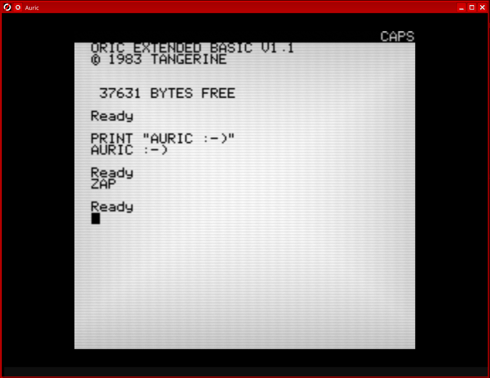
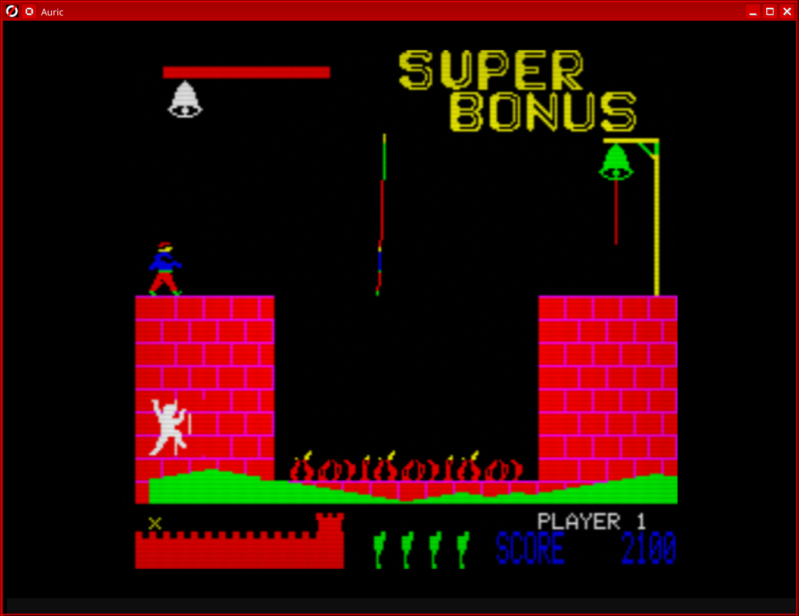
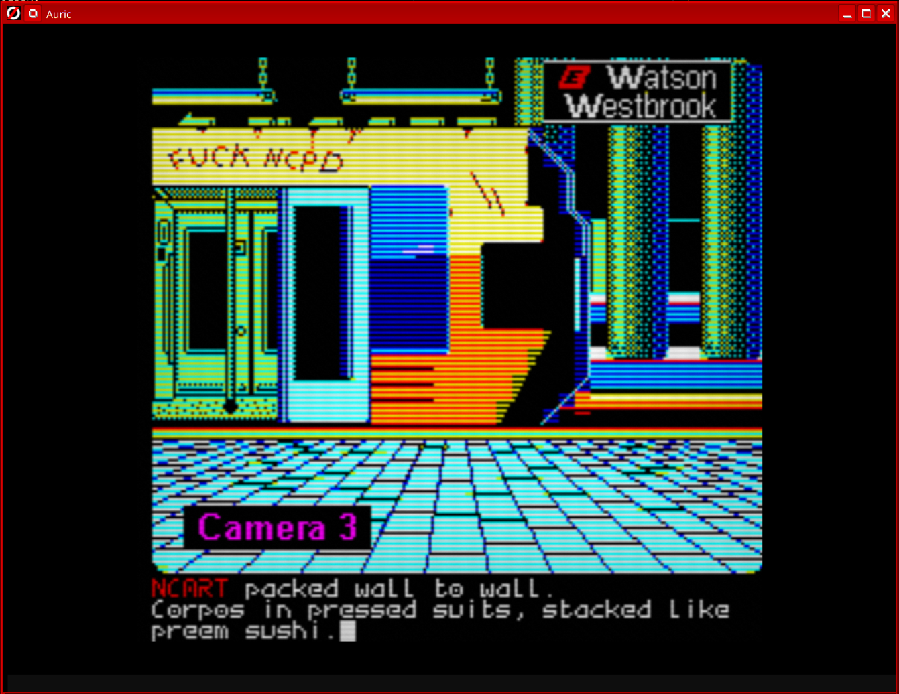
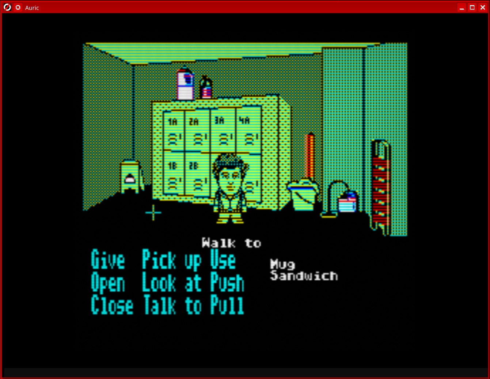
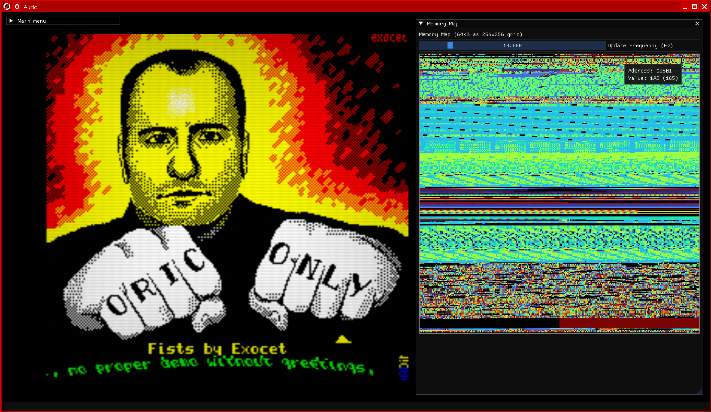

<p align="center">

</p>

*(Renamed from Pugo-Oric 2026)*


This project implements an Oric computer emulator with graphics, sound, tape and disk support.
All code is written from scratch.

It is my absolutely slowest project, just made out of love to programming and to my first computer.

<p align="center">

</p>

## Screenshots

<div>





</div>

Memory map and debugger is available in the emulator.

<div>

</div>

## Background

This is the result of a *very* long and low intensive hobby project I have worked on
since 2009, which currently is 17 years.

The purpose was to develop an emulator of the first computer I ever got,
as a Christmas gift some 40 years ago. The computer was an Oric 1, and it
was fantastic back then!

There already is a brilliant emulator of Oric: Oricutron. The purpose of my emulator
is not to compete, but to learn more about how emulators work and to close the circle
by learning more about the computer I got as a kid.


## Building

Auric has been developed and tested on Linux and MacOS. It does build on Linux, MacOS and Windows.

All building instructions are located in the `doc` directory.

 * To build with vcpkg, see [doc/BUILD_VCPKG.md](doc/BUILD_VCPKG.md).
 * To build with host libraries, see [doc/BUILD_HOST.md](doc/BUILD_HOST.md).
 * To build on Windows, see [doc/BUILD_WINDOWS.md](doc/BUILD_WINDOWS.md).

## Running

This section describes how to run the emulator.

### ROM files

Auric needs ROM files to be able to emulate the Oric 1 and Oric Atmos computers. 
The ROM files are not included in this project, but can be extracted from a real
ORIC computer or found on the internet.

For details about the ROM files, see [ROMS/README_ROMS.md](ROMS/README_ROMS.md).

### Starting the emulator

```
$ ./build/auric
```
### Command line arguments

Run the emulator with flag `-?` (or `--help`) to see available parameters.

Current command line arguments are:

```
Usage: oric [--help] [--config VAR] [--oric1] [--width VAR] [--height VAR] [--tape VAR] 
            [--tape-autostart-off] [--tape-turbo-off] [--disk1 VAR] [--disk2 VAR] 
            [--disk3 VAR] [--disk4 VAR] [--monitor] [--verbose]

Optional arguments:
  -?, --help            produce help message 
  -c, --config          path to configuration file 
  -1 --oric1            use Oric 1 mode (default: Atmos mode) 
  -w, --width           window width in pixels 
  -h, --height          window height in pixels 
  -t, --tape            tape image file to use 
  --tape-autostart-off  turn off tape autostart 
  --tape-turbo-off      turn off tape turbo mode 
  -d, --disk1           disk image file to use for drive 1 
  --disk2               disk image file to use for drive 2 
  --disk3               disk image file to use for drive 3 
  --disk4               disk image file to use for drive 4 
  -m, --monitor         start with GUI debugger open 
  -v, --verbose         verbose output 
```

### Exiting

To exit the emulator, use any of the following alternatives.

* Close the emulator window.
* Press `CTRL-C` _in the console window_.

### Main menu

The in-emulator main menu can be toggled with `F1`. It allows you to change
the emulator settings, load tape and disk images, and more.

### Control keys

The following control keys can alter the emulator behavior.

* `F1`: Toggle main menu
* `F2`: Save snapshot (to RAM)
* `F3`: Load snapshot (from RAM)
* `CTRL-W`: Toggle warp mode (go as fast as possible, speed up non-turbo tape loading, etc.)
* `CTRL-R`: Soft reset the emulator (NMI)
* `CTRL-B`: Break to debugger (in console).

### Loading from tape image

To specify which tape TAP file to use, use the `--tape` or `-t` command line
argument:

```
$ ./build/auric --tape taps/hunchbk.tap
```

Auric by default uses tape autostart and tape turbo mode. This means that the tape will 
be loaded automatically and as fast as possible. If you want to turn off autostart or 
turbo mode, use the `--tape-autostart-off` or `--tape-turbo-off` command line arguments.

To manually load any tape program from the emulator you can try the following.

```
CLOAD""
```

### Saving to tape image

Auric supports saving to TAP files. When writing to file from the emulator, the data will
be saved to the TAP file automatically.

The file to write to is specified with the `--tape` or `-t` command line argument.

It is possible to write multiple files to the same TAP file. The emulator will append the
new data to the end of the file. Loading with a specified file name will load the first
following file with that name in the TAP file.

The main menu (toggle with `F1`) has a "Rewind" button that will rewind the tape to the
beginning of the TAP file.

There is no write protection mechanism.

### Loading from disk image

Auric supports loading from Microdisk images.

To specify which disk image file to use, use the `--disk` or `-d` command line
argument:

```
$ ./build/auric --disk disk/oricpetscii.dsk
```

It is possible to specify up to four disk images, one for each drive. 
Use the `--disk2`, `--disk3` and `--disk4` command line arguments for the other drives.

### Saving to disk image

Auric supports saving to Microdisk images.

If a Microdisk image is assigned, and data is written to the disk,
then the changes will be saved to the image file automatically.
There is no write protection mechanism.

## Monitor/Debugger

You can at any time enter a monitor mode by pressing `ctrl-b` inside the emulator.

The monitor is shown as a panel in the emulation window. It allows you to 
inspect the state of the emulated computer, set breakpoints, and more.

The monitor has commands like the following.

```
Available monitor commands:

ay              : print AY-3-8912 sound chip info
bs <address>    : set breakpoint for address
d               : disassemble from last address or PC
d <address> <n> : disassemble from address and n bytes ahead (example: d c000 10)
debug           : show debug output at run time
g               : go (continue)
g <address>     : go to address and run (example: g 1f00)
h               : help (showing this text)
i               : print machine info
m <address> <n> : dump memory from address and n bytes ahead (example: m 1f00 20)
pc <address>    : set program counter to address
quiet           : prevent debug output at run time
q               : quit
s [n]           : step one or possible n steps
sr, softreset   : soft reset oric
v               : print VIA (6522) info
```
 

## Timeline

As I work as a developer this has been a project I have gone back to for shorter
stints when normal work for some reason have had less amount of coding. That means
that this project has been extremely slow. But that has always been a wonderful thing!
I have never felt any pressure to work on it and instead hacked on it by pure love.

The first thing I developed was naturally the MOS 6502 emulation. That took several
years of now-and-then coding. Then after some delay the MOS 6522 VIA (IO) chip work
started and took some more years. After that I added graphics support, keyboard
emulation, tape loading and lastly sound.

The timeline is something like:

* **2009:** MOS 6502 CPU
* **2014:** MOS 6522 VIA
* **2016:** Graphics
* **2017:** Key input
* **2020:** Tape loading
* **2023:** AY3-8912 sound
* **2024:** Cycle bug fixing, new monitor, blink mode, snapshots
* **2025:** Status bar, new tape loading, zoom
* **2026:** Microdisk loading and saving, moved to SDL3,
        in emulation GUI, multi drive support, free window resizing, memory map view,
        Windows 10/11 support (thanks Dagfinn Dybvig!), Tape turbo loading,
        Tape autostart, in emulation window debugger, tape saving.


## Contributions

Any contributions are welcome! The project exists on GitHub: https://github.com/pugo/Auric. 
That is the best place to report issues, request features, and submit pull requests.

### Auric heroes this far:
  * **Anders Piniesjö:** (myself) for lots of coding, testing, and debugging.
  * **Dagfinn Dybvig:** Windows 10/11 build support 

## License

All code is licensed with GPL v3.

---
Sweden, Linghem 2026, Anders Piniesjö
